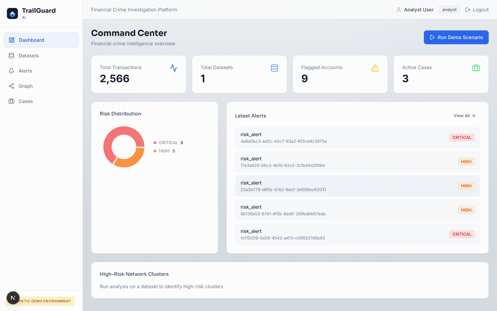
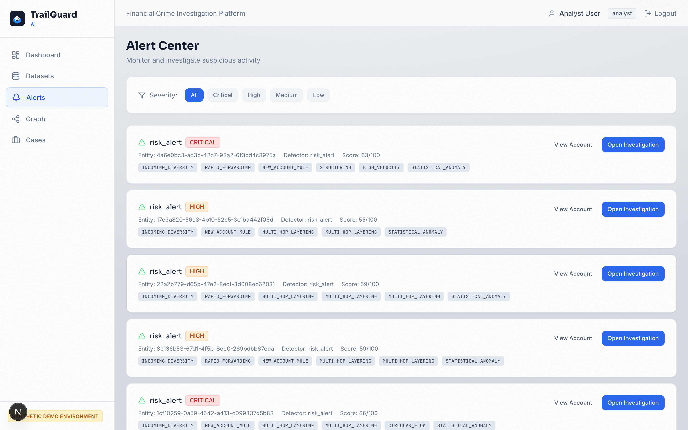
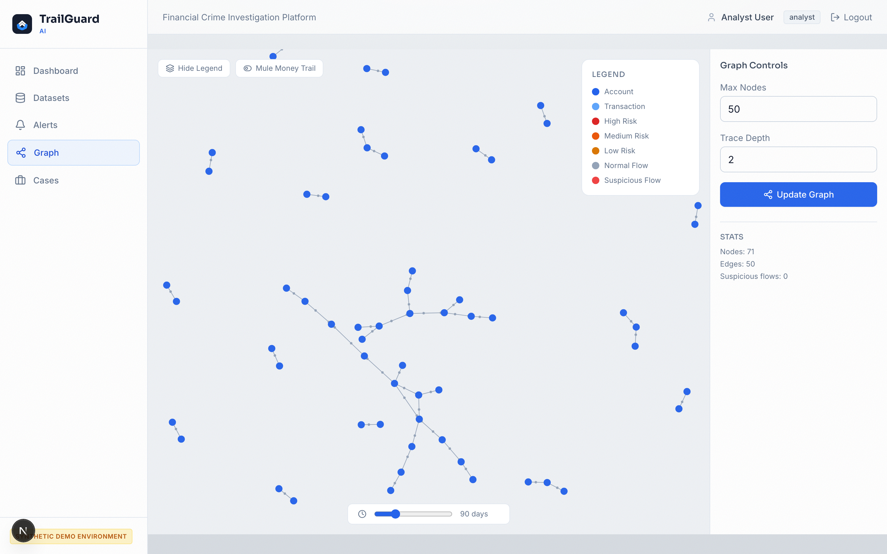
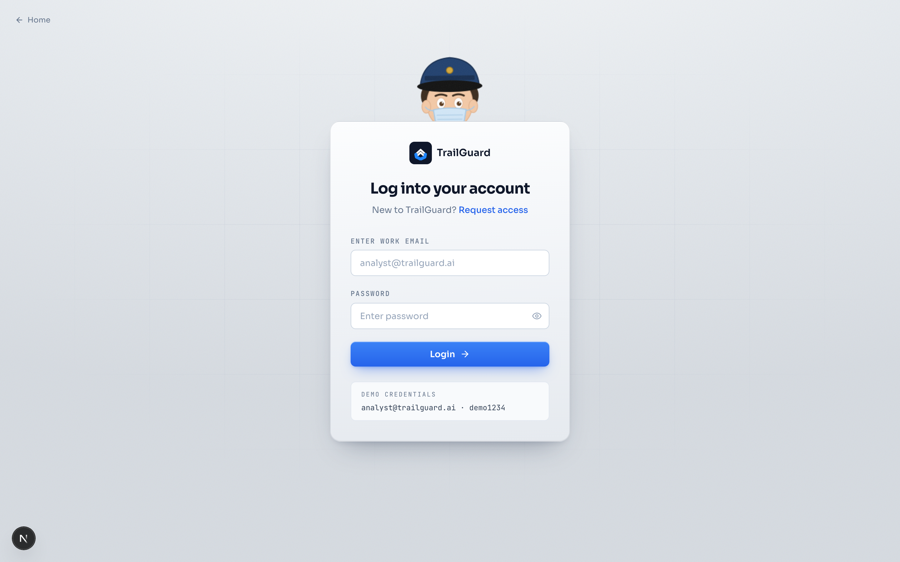
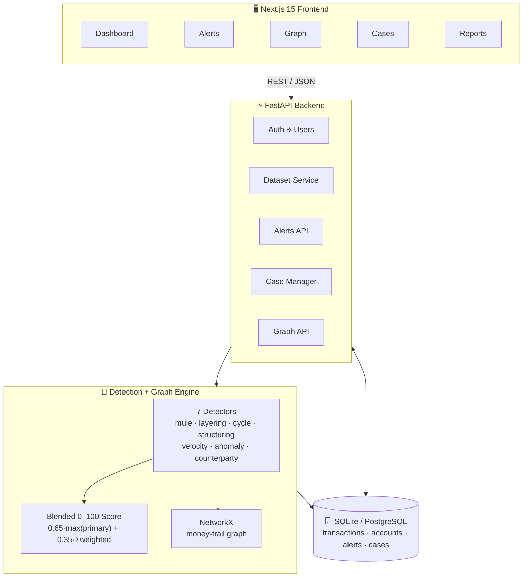
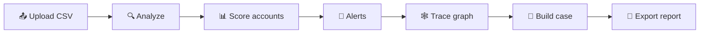

<div align="center">


# TrailGuard AI

### Explainable Financial-Crime Intelligence Platform

**Follow the money. Surface the truth.**

Ingest transactions → score accounts with a 7-signal engine → trace the money on a live graph → turn alerts into evidence-backed cases.

<br/>

[](https://www.python.org/)
[](https://fastapi.tiangolo.com/)
[](https://nextjs.org/)
[](https://react.dev/)
[](https://tailwindcss.com/)
[](https://scikit-learn.org/)
[](https://networkx.org/)
[](#-testing)
[](LICENSE)

<br/>


<sub><b>Synthetic data only. Human review is always required before any action.</b></sub>

</div>

---

<div align="center">

[**Why**](#-why-trailguard) · [**Screens**](#-the-product) · [**Detection Engine**](#-the-detection-engine) · [**Architecture**](#-architecture) · [**Quick Start**](#-quick-start) · [**Demo**](#-demo-flow) · [**Stack**](#-tech-stack) · [**Team**](#-team)

</div>

---

## 🎯 Why TrailGuard

Most AML tools stop at a number. An account gets a risk score, an analyst gets an alert, and the *reasoning* stays locked in a black box. Investigators then rebuild the story by hand across spreadsheets.

TrailGuard runs the whole investigation instead of just the first step:

```
Traditional:   Transaction ──▶ Risk Score ──▶ Alert         (and nothing more)

TrailGuard:     Transaction ──▶ 7-Signal Score ──▶ Pattern Evidence
                            ──▶ Money-Trail Graph ──▶ Case ──▶ Report
```

**What makes it different**

- **Not a black box.** Every alert carries a component-score breakdown, human-readable reason codes, and the exact transactions that triggered it.
- **Graph-native.** Watch funds fan in from victims, pass through mules, and drain to exit accounts, instead of reading rows.
- **Built for the analyst.** Alert → investigation case → regulator-ready report draft, without leaving the tool.

---

## 🖥️ The Product

<table>
  <tr>
    <td width="50%" align="center">
      <br/>
      <b>Dashboard</b><br/>
      <sub>Portfolio risk, alert volume, and detector activity at a glance</sub>
    </td>
    <td width="50%" align="center">
      <br/>
      <b>Explainable Alerts</b><br/>
      <sub>Risk score, reason codes, and linked transactions per account</sub>
    </td>
  </tr>
  <tr>
    <td width="50%" align="center">
      <br/>
      <b>Money-Trail Graph</b><br/>
      <sub>Trace funds backward to sources and forward to exit points</sub>
    </td>
    <td width="50%" align="center">
      <br/>
      <b>Secure Access</b><br/>
      <sub>Token-based auth gating every investigation screen</sub>
    </td>
  </tr>
</table>

---

## 🧠 The Detection Engine

TrailGuard blends **seven independent detectors** into a single explainable 0–100 score. Each detector returns a 0–1 signal plus reason codes and the transactions that fired it.

| # | Detector | Weight | Catches |
|---|----------|:------:|---------|
| 1 | **Mule** | `0.25` | Fan-in / fan-out funnels: many senders in, rapid forwarding out |
| 2 | **Anomaly** (Isolation Forest) | `0.15` | Statistical outliers in amount, timing, and counterparty mix |
| 3 | **Layering** | `0.15` | Pass-through chains `A → B → C → D` that obscure fund origin |
| 4 | **Counterparty** | `0.15` | Concentration and risky-partner exposure |
| 5 | **Cycle** | `0.10` | Circular flows where money returns to its source |
| 6 | **Structuring** | `0.10` | Smurfing: amounts kept just under reporting thresholds |
| 7 | **Velocity** | `0.10` | Bursts of activity far above an account's normal rate |

### How the score is blended

A plain weighted average buries strong evidence (a clear structuring case at `0.9` would only add `0.09`). So TrailGuard weights the **strongest laundering pattern** heavily, then layers the rest on top:

```python
PRIMARY = (mule, layering, cycle, structuring)

risk_score = 0.65 × max(PRIMARY signals)  +  0.35 × weighted_sum(all 7 signals)
#            └─ one clear pattern is enough ─┘   └─ corroboration from the rest ─┘
```

| Risk level | Score | Behaviour |
|------------|:-----:|-----------|
| 🟥 **CRITICAL** | `≥ 60` | Clear laundering pattern → alert |
| 🟧 **HIGH** | `≥ 48` | Strong suspicion → alert |
| 🟨 **MEDIUM** | `≥ 35` | Watchlist |
| 🟩 **LOW** | `< 35` | Normal activity |

The engine is anchored to the dataset's reference time and runs whole-graph layering and cycle passes once per analysis, so scores stay stable and comparable across a dataset. It's calibrated against a labelled synthetic dataset: planted frauds (mule, cycle, layering, structuring) rank HIGH/CRITICAL while normal high-volume accounts stay LOW, locked in by [`test_detection_ground_truth.py`](services/api/tests/test_detection_ground_truth.py).

---

## 🏗️ Architecture



**The investigation pipeline**



---

## 🚀 Quick Start

**Prerequisites:** Python 3.12+, Node.js 20+, npm

```bash
git clone https://github.com/abhinavv27/TrailGuard.git
cd TrailGuard
```

### 1 · Backend — FastAPI on `:8000`

```bash
cd services/api
python -m venv .venv
source .venv/bin/activate          # Windows: .venv\Scripts\activate
pip install -r requirements.txt

python -m app.db.seed              # creates tables + loads the synthetic dataset
uvicorn app.main:app --reload --port 8000
```

### 2 · Frontend — Next.js on `:3000`

```bash
cd apps/web
npm install
npm run dev
```

### 3 · Open & log in

| Service | URL |
|---------|-----|
| 🖥️ Dashboard | http://localhost:3000 |
| ⚡ API | http://localhost:8000 |
| 📚 API docs (Swagger) | http://localhost:8000/docs |

> **Demo login:** `analyst@trailguard.ai` / `demo1234`  ·  admin: `admin@trailguard.ai` / `admin1234`

Prefer containers? `docker compose up` brings the stack up together.

---

## 🎬 Demo Flow

1. **Load data** — the synthetic dataset is seeded by default (or upload your own CSV on the Datasets screen).
2. **Run analysis** — the engine scores every account across all 7 detectors.
3. **Review alerts** — open a CRITICAL mule alert and read its score breakdown, reason codes, and linked transactions.
4. **Trace the money** — follow funds on the interactive graph from victim accounts, through mules, to exit points.
5. **Build a case** — convert the alert into a structured investigation with notes and an evidence timeline.
6. **Export a report** — generate a regulator-ready investigation draft.

---

## 🧩 Tech Stack

<div align="center">


<br/><br/>


</div>

| Layer | Technology |
|-------|-----------|
| **Frontend** | Next.js 15 (App Router), React 19, TypeScript, Tailwind CSS 3.4, Motion, Recharts, React Force Graph 2D, TanStack Query |
| **Backend** | FastAPI, Pydantic, SQLAlchemy, Uvicorn |
| **Detection** | scikit-learn (Isolation Forest), NumPy, pandas, custom rule + temporal detectors |
| **Graph** | NetworkX (whole-graph layering / cycle analysis) |
| **Database** | SQLite (dev) · PostgreSQL (prod) |
| **Testing** | pytest (backend) · Vitest + Playwright (frontend) |

---

## 📂 Project Structure

```
TrailGuard/
├── apps/
│   └── web/                          # Next.js 15 frontend
│       ├── app/                      # Routes: dashboard, alerts, graph,
│       │                             #   cases, datasets, reports, accounts, login
│       ├── components/               # UI primitives, layout, landing visuals
│       └── public/                   # Logo, screenshots, pitch deck assets
├── services/
│   └── api/                          # FastAPI backend
│       └── app/
│           ├── main.py               # App entry (auto-creates tables)
│           ├── api/v1/               # auth · datasets · alerts · cases ·
│           │                         #   accounts · graph · dashboard · demo
│           ├── detection/            # 7 detectors + blended scoring engine
│           ├── graph/                # NetworkX builder & metrics
│           ├── services/             # Dataset ingest + analysis orchestration
│           ├── models/               # SQLAlchemy models
│           └── db/seed.py            # Synthetic-dataset seeder
├── data/synthetic/                   # Labelled sample transaction dataset
└── docker-compose.yml
```

<details>
<summary><b>🔌 REST API surface</b></summary>

| Group | Purpose |
|-------|---------|
| `auth` | Login, token issue, current user |
| `datasets` | Upload, list, and analyze transaction datasets |
| `alerts` | List and inspect risk alerts with reason codes |
| `accounts` | Per-account profile, metrics, and transactions |
| `graph` | Money-trail neighborhood and trace exploration |
| `cases` | Create and manage investigation cases |
| `dashboard` | Portfolio-level stats and aggregates |
| `analysis_runs` | Analysis run history and status |
| `demo` / `health` | Demo helpers and liveness checks |

Full interactive spec at `http://localhost:8000/docs`.

</details>

---

## ✅ Testing

```bash
cd services/api && .venv/bin/python -m pytest    # 29 passing
cd apps/web && npm run test                      # Vitest
```

The backend suite includes a **ground-truth calibration test** that locks in detector behaviour: planted frauds must alert, normal accounts must not, and fraud must outrank normal accounts on score.

---

## 👥 Team

Built by **Team 3CC**

**Abhinav Chauhan** · **Alekhya Mazumdar** · **Dipayan Basu**

---

## 📜 License

MIT — see [LICENSE](LICENSE).

<div align="center">
<br/>
<sub>⚠️ Built with synthetic data for research and demonstration. Not for use in production financial systems without rigorous validation. Human review is always required.</sub>
<br/><br/>
<b>TrailGuard AI</b> · <i>Follow the money. Surface the truth.</i>
</div>
